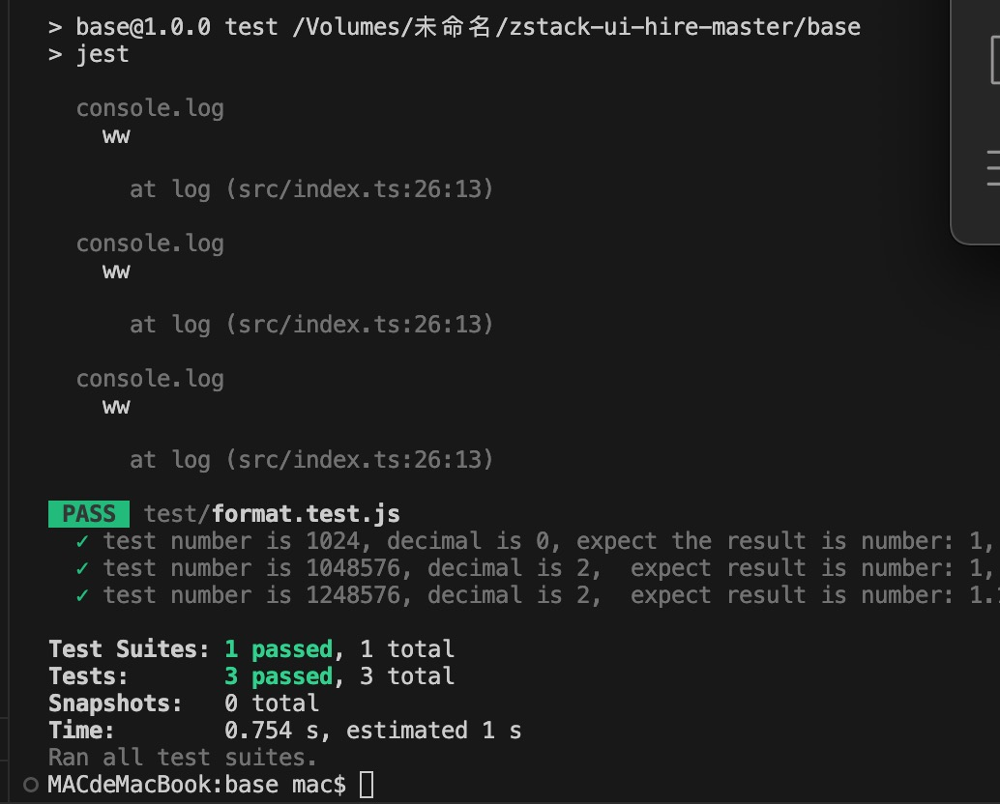

# 加入 ZStack

> 完成一个或多个面试题，获取面试机会，完成的题目越多，质量越高，后续面试加分越多。

## 前端工程师

### 工作内容

> 负责 ZStack 管理界面的开发工作;
>
> 根据需求，设计并实现云计算系统管理界面的前端和后端相关功能;

### 技术栈

- React (Hooks)
- Umi + qiankun
- Typescript

- NestJS
- Graphql

### 展现你的能力

1. [基础编码能力](./questions/base.md)

- 请使用 `Typescript` 完成 `base/src/index.ts` 中的函数，并定义好相关 TS 类型。（60分）

  答案 在 base/src/index.ts

- 单元测试覆盖，包含上述用例。（20分）

  答案 在 base/test/format.test.js
  在 base 目录下 pnpm i 然后 pnpm test 查看 测试结果
  

  
- 配置 eslint 和 prettier。（10分）
  
  答案 在 base/.eslintrc.js   base/.prettierrc

  prettierrc 效果
  

  eslintrc 效果
  

  
- 配置 pre-commit 和 commitlint。（10分）

  答案在 base/commitlint.config.js  以及  base/package.json

- 以 NestJS 为框架，为此功能提供一个 post api（bonus）
  
  分别进入 base/nestjs pnpm i  pnpm start:dev   启动nestjs 服务

   base/nextjs pnpm i   pnpm dev 启动 前端服务
   前端首页
   输入 点击提交
   
